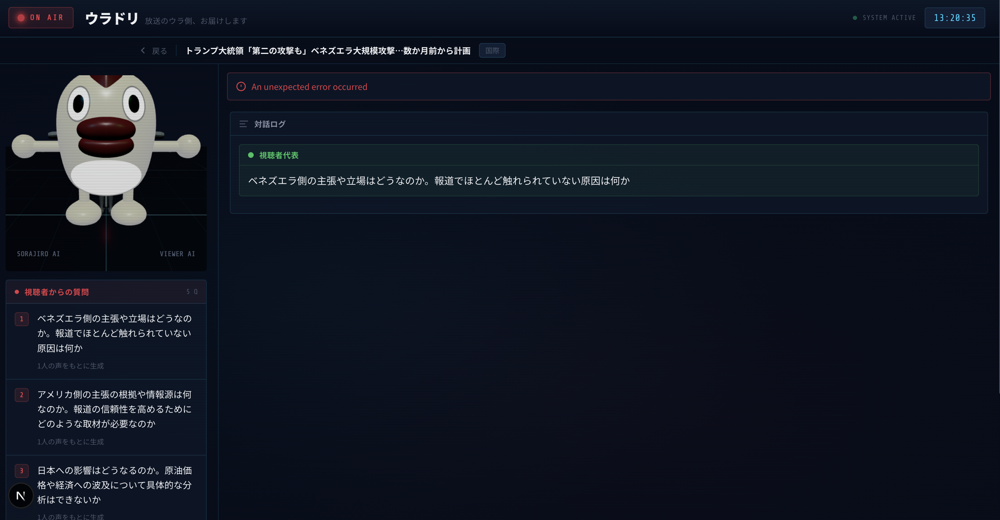

# ウラドリ

> 放送のウラ側、お届けします



テレビの尺の制約でカットされた取材情報を、AI対話を通じて視聴者に届けるデュアルプラットフォームアプリケーション。

## 課題と解決策

テレビ放送では尺の制約により取材情報の大半がカットされ、視聴者は断片的な情報しか得られません。ウラドリは、放送中・放送後に視聴者の声を蓄積し、**日テレ取材フル素材を持つソラジローAI** と **視聴者の声を集約した視聴者代表AI** がリアルタイムで対話することで、双方向メディアを実現します。

## 体験フロー

```
① 放送中      視聴者が「声」でリアルタイムに意見を発言
② トピック終了  視聴者の声が集約 → 2つのAIが空間上で対話開始
③ AI対話中    ソラジローAIが3層情報（放送/未放送/オープンデータ）で応答
```

## システム構成

```
┌──────────────────────┐     ┌──────────────────────┐
│  Apple Vision Pro    │     │      Web Client       │
│  visionOS native     │     │  Next.js + R3F        │
│  SwiftUI/RealityKit  │     │  3Dアバター対話UI     │
└────────┬─────────────┘     └────────┬──────────────┘
         │         SSE / REST         │
         └────────────┬───────────────┘
              ┌───────▼───────┐
              │  Cloudflare   │
              │  Workers      │
              │  (Hono API)   │
              └───┬───┬───┬───┘
           ┌──────┘   │   └──────┐
           ▼          ▼          ▼
          D1     Workers AI   Vectorize
        (SQLite)  (LLM+Emb)   (RAG)
```

## Tech Stack

### Server (`server/`)

| 技術 | 用途 |
|------|------|
| Hono + Cloudflare Workers | APIサーバー |
| Drizzle ORM + D1 | データベース |
| Workers AI (llama-3.1-70b) | LLM対話・質問生成 |
| Vectorize + bge-m3 | RAGベクトル検索 |
| ElevenLabs | TTS音声合成 |

### Web (`web/`)

| 技術 | 用途 |
|------|------|
| Next.js 16 (App Router) | フレームワーク |
| React Three Fiber | 3Dアバター描画 |
| Tailwind CSS 4 | スタイリング |

### iOS (`ios/`)

| 技術 | 用途 |
|------|------|
| SwiftUI + RealityKit | visionOS空間UI |
| Speech Framework | 音声認識 |
| AVFoundation | 動画再生 |

## 開発セットアップ

### Server

```bash
cd server
pnpm install
pnpm run dev              # ローカル開発サーバー
pnpm run deploy           # Cloudflare Workers デプロイ
pnpm run cf-typegen       # バインディング型生成
```

### Web

```bash
cd web
pnpm install
pnpm run dev              # http://localhost:3000
```

### iOS

Xcode 15+ で `ios/ios.xcodeproj` を開き、visionOS シミュレーターでビルド。

## API エンドポイント

| Method | Path | Auth | 概要 |
|--------|------|------|------|
| POST | `/api/topics` | Admin | トピック登録 |
| GET | `/api/topics` | - | トピック一覧 |
| POST | `/api/topics/import` | Admin | 外部APIから一括インポート |
| POST | `/api/voice` | - | 視聴者の声を蓄積 |
| POST | `/api/dialog/start` | - | AI対話開始 (SSEストリーム) |
| POST | `/api/ingest` | Admin | 素材をVectorize登録 |
| POST | `/api/tts/synthesis` | - | 音声合成 |

## プロジェクト構成

```
uradori/
├── server/           # Hono + Cloudflare Workers API
│   └── src/
│       ├── shared/   # DB・認証・共通スキーマ
│       └── feature/  # topic / voice / dialog / ingest / tts
├── web/              # Next.js Web クライアント
│   └── src/
│       ├── app/      # App Router ページ
│       └── components/  # avatar / dialog / voice / topic
├── ios/              # visionOS ネイティブアプリ
│   └── ios/
│       ├── Views/    # SwiftUI + RealityKit
│       ├── Models/   # AI状態管理
│       └── Services/ # API通信・音声認識
└── docs/             # 仕様書・3Dモデル
```

## ライセンス

Private
